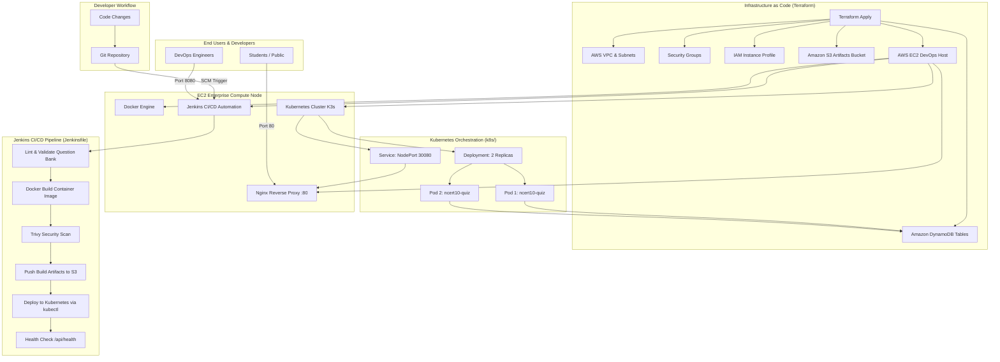

# BoardReady (ncert10-quiz) — Enterprise DevOps Architecture & Guide

This project implements the industry-standard, classic enterprise DevOps stack:

$$\text{Terraform} \implies \text{AWS EC2} \implies \text{AWS S3} \implies \text{Docker} \implies \text{Kubernetes} \implies \text{Jenkins}$$

---

## 1. High-Level Enterprise Architecture



---

## 2. Core Pillars of the DevOps Stack

### 1. Terraform (Infrastructure as Code)
* **Location**: `terraform/`
* **Responsibilities**:
  * Provisions network infrastructure: VPC, public subnets, internet gateway, and route tables (`vpc.tf`).
  * Provisions the enterprise S3 artifacts bucket with encryption and versioning (`s3.tf`).
  * Provisions the EC2 host with automated bootstrap user-data (`ec2.tf`).
  * Configures least-privilege IAM roles and instance profiles (`iam.tf`).
  * Configures security group firewall rules (`security_groups.tf`).
  * Provisions DynamoDB tables for quiz attempts and global/subject leaderboards (`dynamodb.tf`).

### 2. AWS EC2 (Compute Host)
* **Instance Type**: `t3.medium` (or `t3.small` / `t3.micro` with configured swap).
* **OS**: Amazon Linux 2023 / Ubuntu 22.04 LTS.
* **Responsibilities**:
  * Runs the **Docker daemon** for container builds and local execution.
  * Runs the **Kubernetes (K3s)** single-node certified CNCF cluster.
  * Runs the **Jenkins CI/CD** controller and local build executor.
  * Runs **Nginx** reverse proxy mapping public port 80 to Kubernetes NodePort 30080.

### 3. Amazon S3 (Artifact & Package Storage)
* **Location**: `terraform/s3.tf`
* **Responsibilities**:
  * Long-term archive for Jenkins build manifests, test reports, and metadata.
  * Encrypted storage (AES256) with bucket versioning enabled.
  * Private bucket with AWS Public Access Block strictly enforced.

### 4. Docker (Containerization)
* **Location**: `Dockerfile`, `.dockerignore`, `docker-compose.yml`
* **Features**:
  * **Multi-stage build**:
    1. `deps`: Installs production and build dependencies.
    2. `builder`: Verifies question bank schema and compiles Next.js standalone package.
    3. `runner`: Ultra-lightweight Alpine Linux runner running non-root `nextjs` user.
  * Self-contained healthcheck via `wget /api/health`.

### 5. Kubernetes (Container Orchestration)
* **Location**: `k8s/`
* **Manifests**:
  * `namespace.yaml`: Dedicated `ncert10-quiz` namespace.
  * `configmap.yaml` & `secret.yaml`: Externalized environment and AWS DynamoDB configs.
  * `deployment.yaml`: Replicas with rolling update strategy (`maxSurge: 1`, `maxUnavailable: 0`), non-root security context, CPU/Memory limits, and readiness/liveness probes.
  * `service.yaml`: `NodePort 30080` routing traffic to pod port 3000.
  * `hpa.yaml`: Horizontal Pod Autoscaler scaling from 2 to 10 pods based on CPU/Memory load.
  * `kustomization.yaml`: Single command deployment (`kubectl apply -k k8s/`).

### 6. Jenkins (Continuous Integration & Continuous Deployment)
* **Location**: `Jenkinsfile`
* **Pipeline Stages**:
  1. **Checkout**: Pulls latest Git source.
  2. **Install**: Installs dependencies cleanly.
  3. **Verification**: Parallel ESLint, TypeScript typecheck, and NCERT bank schema validation.
  4. **Docker Build**: Compiles Docker image tagged with `${BUILD_NUMBER}`.
  5. **Security Scan**: Scans Docker image for CVEs using Trivy.
  6. **S3 Archive**: Ships build metadata and logs to Amazon S3.
  7. **Deploy to K8s**: Executes rolling deployment via `kubectl apply -k ./k8s/`.
  8. **Smoke Test**: Queries live `/api/health` probe to confirm service uptime.

---

## 3. Quickstart & Deployment Commands

### Step 1: Provision AWS Infrastructure via Terraform
```bash
cd terraform
terraform init
terraform plan -var-file="environments/dev.tfvars"
terraform apply -var-file="environments/dev.tfvars" -auto-approve
```

### Step 2: Access Endpoints
After `terraform apply` finishes, it outputs:
* **Quiz App URL**: `http://<EC2_PUBLIC_IP>` (routed to Kubernetes)
* **Jenkins Dashboard**: `http://<EC2_PUBLIC_IP>:8080`
* **S3 Artifacts Bucket**: `<bucket-name>`

### Step 3: Run Local Validation Before Commit
```bash
npm run validate:bank   # Verifies all 120 NCERT questions
npm run typecheck       # Verifies TypeScript safety
npm run build           # Compiles Next.js standalone build
```

---

## 4. Useful Operational Commands on the EC2 Host

```bash
# Check Docker images and containers
docker ps
docker images

# Check Kubernetes Pods, Deployments, and Services
kubectl get pods -n ncert10-quiz
kubectl get svc -n ncert10-quiz
kubectl logs -l app.kubernetes.io/name=ncert10-quiz -n ncert10-quiz --tail=50

# Check Jenkins service
systemctl status jenkins

# Inspect S3 Artifacts
aws s3 ls s3://<s3_artifacts_bucket>/builds/
```
